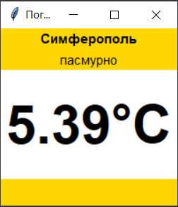
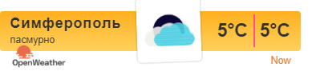

<p align="center">МИНИСТЕРСТВО НАУКИ  И ВЫСШЕГО ОБРАЗОВАНИЯ РОССИЙСКОЙ ФЕДЕРАЦИИ<br>
Федеральное государственное автономное образовательное учреждение высшего образования<br>
"КРЫМСКИЙ ФЕДЕРАЛЬНЫЙ УНИВЕРСИТЕТ им. В. И. ВЕРНАДСКОГО"<br>
ФИЗИКО-ТЕХНИЧЕСКИЙ ИНСТИТУТ<br>
Кафедра компьютерной инженерии и моделирования</p>
<br>
<h3 align="center">Отчёт по лабораторной работе № 1<br> по дисциплине "Программирование"</h3>
<br><br>
<p>студента 1 курса группы ПИ-б-о-202(1)<br>
Иванов Александр Сергеевич<br>
направления подготовки 09.03.04 "Программная инженерия"</p>
<br><br>
<table>
<tr><td>Научный руководитель<br> старший преподаватель кафедры<br> компьютерной инженерии и моделирования</td>
<td>(оценка)</td>
<td>Чабанов В.В.</td>
</tr>
</table>
<br><br>
<p align="center">Симферополь, 2020</p>
<hr>

## Цель работы

1)Закрепить навыки разработки многофайловыx приложений;
2)Изучить способы работы с API web-сервиса;
3)Изучить процесс сериализации/десериализации данных в/из json;
4)Получить базовое представление о сетевом взаимодействии приложений; 

## Постановка задачи

Разработать сервис предоставляющий данные о погоде в городе Симферополе на момент запроса.  В качестве источника данных о погоде используйте: http://openweathermap.org/. В состав сервиса входит: серверное приложение на языке С++ и клиентское приложение на языке Python.

Серверное приложение (далее Сервер) предназначенное для обслуживания клиентских приложений и минимизации количества запросов к сервису openweathermap.org. Сервер должен обеспечивать возможность получения данных в формате JSON и виде html виджета (для вставки виджета на страницу будет использоваться iframe).

Клиентское приложение должно иметь графический интерфейс отображающий сведения о погоде и возможность обновления данных по требованию пользователя.

## Выполнение работы

1) Регистрируемся на сайте openweathermap.org, подтверждаем электронную почту, генерируем собственный API ключ: ```842fc3a1dc489d72adfd0262976857ba```

2) Составляем запрос (зад. 1.7) на получение прогноза погоды для Симферополя с почасовым интервалом, в градусах Цельсия, на русском языке: ```http://api.openweathermap.org/data/2.5/onecall?lat=44.948237&lon=34.100318&exclude=current,minutely,daily,alerts&units=metric&lang=ru&appid=842fc3a1dc489d72adfd0262976857ba```
Где "lang" отвечает за язык, units  отвечает за системы измерения, а exclude исключает вывод по опреденному формату(например, в данном случае у нас вывод с почасовым интервалом)

3)Составляем запрос на получение времени в формате json, без регистрации на сайте ```http://worldtimeapi.org/pages/schema```. У нас получается вот такое запрос: ```http://worldtimeapi.org/api/timezone/Europe/Simferopol```

4)Исходный код созданного мною серверного приложения на с++

```C++
#include <iostream>
#include <nlohmann/json.h>
#include<iomanip>
#include<fstream>
#include <string>
#include <cpp_httplib/httplib.h>
using json = nlohmann::json;
using namespace httplib;
using namespace std;
json jtime;
json jcache;
string ht;
json memory;
bool baal = false;

void cli() {
	ifstream fil("weather.html");
	getline(fil, ht, '\0');
	Client cli("http://api.openweathermap.org");
	auto data = cli.Get("/data/2.5/onecall?lat=44.948237&lon=34.100318&exclude=current,minutely,daily,alerts&units=metric&lang=ru&APPID=842fc3a1dc489d72adfd0262976857ba");

	if (data) {
		if (data->status != 200) {
			std::cout << "Status code: " << data->status << std::endl;
		}
	}
	else {
		auto err = data.error();
		std::cout << "Eror code: " << err << std::endl;

	}
	httplib::Client time("http://worldtimeapi.org");
	auto data1 = time.Get("/api/timezone/Europe/Simferopol");

	if (data1) {
		if (data1->status != 200) {
			std::cout << "Status code: " << data1->status << std::endl;
		}
	}
	else {
		auto err = data1.error();
		std::cout << "Eror code: " << err << std::endl;

	}

	jtime = json::parse(data1->body);
	if (jcache.empty()) {
		jcache = json::parse(data->body);

	}
	for (int i = 0; i < jcache["hourly"].size(); i++) {
		if (jcache["hourly"][i]["dt"] > jtime["unixtime"]) {
			baal = true;
			memory = jcache["hourly"][i];
			break;
		}
	}
	if (!baal) {
		jcache = json::parse(data->body);
	}
}


void gen_response(const Request& req, Response& response) {
	cli();
	string html = ht;
	std::string str2 = "{hourly[i].weather[0].description}";
	std::string str3 = "{hourly[i].weather[0].icon}";
	std::string str4 = "{hourly[i].temp}";
	html.replace(html.find(str2), str2.length(), memory["weather"][0]["description"]);
	html.replace(html.find(str3), str3.length(), memory["weather"][0]["icon"]);
	html.replace(html.find(str4), str4.length(), to_string(int(memory["temp"].get<double>())));
	html.replace(html.find(str4), str4.length(), to_string(int(memory["temp"].get<double>())));

		response.set_content(html, "text/html");

	
}

void raw(const Request& req, Response& response) {
	ifstream fil("weather.html");
	getline(fil, ht, '\0');
	Client cli("http://api.openweathermap.org");
	auto data = cli.Get("/data/2.5/onecall?lat=44.948237&lon=34.100318&exclude=current,minutely,daily,alerts&units=metric&lang=ru&APPID=842fc3a1dc489d72adfd0262976857ba");

	if (data) {
		if (data->status != 200) {
			std::cout << "Status code: " << data->status << std::endl;
		}
	}
	else {
		auto err = data.error();
		std::cout << "Eror code: " << err << std::endl;

	}
	httplib::Client time("http://worldtimeapi.org");
	auto data1 = time.Get("/api/timezone/Europe/Simferopol");

	if (data1) {
		if (data1->status != 200) {
			std::cout << "Status code: " << data1->status << std::endl;
		}
	}
	else {
		auto err = data1.error();
		std::cout << "Eror code: " << err << std::endl;

	}

	jtime = json::parse(data1->body);
	if (jcache.empty()) {
		jcache = json::parse(data->body);

	}
	for (int i = 0; i < jcache["hourly"].size(); i++) {
		if (jcache["hourly"][i]["dt"] > jtime["unixtime"]) {
			baal = true;
			memory = jcache["hourly"][i];
			break;
		}
	}
	if (!baal) {
		jcache = json::parse(data->body);
	}
	json push;

	push["d"] = memory["weather"][0]["description"];
	push["t"] = memory["temp"];

	response.set_content(push.dump(), "text/json");
}

int main(){
	
	Server srv;
	srv.Get("/", gen_response);
	srv.Get("/raw", raw);
	
	std::cout << "Start server..." << std::endl;
	srv.listen("localhost", 3000);
	
}```

5) Исходный код созданного мною клиентского приложения на Python
```Python
from tkinter import *
import json
from tkinter.font import BOLD
import requests

def cli(event=None):	 #Отправляем запрос
	try:			
		response = requests.get("http://localhost:3000/raw").content.decode("utf8")
		forecast_j = json.loads(response)

		d.config(text=str(forecast_j["d"]))
		temperature.config(text=str(forecast_j["t"]) + "°C")
	except requests.exceptions.ConnectionError:	#В случае ошибки 						прорабатывается эта часть кода
		pass


#Далее создаем окно,кнопку и даем название своего окна
root = Tk()
root.bind("<Button-1>", cli)
root.title("Погода")
root.pack_propagate(0)


down = Frame(root, bg='gold', width=100, height=30) #Создание золотого верхнего нижнего участка
up =    Frame(root, bg='gold', width=100, height=30) #Создание верхнего участка
mid = Frame(root, bg="#ffffff",  width=100, height=90) #Создание центрального белого участка


#пакуем фреймы
down.pack(side=BOTTOM, fill=X)
up.pack(side=TOP, fill=X)
mid.pack(expand=True, fill=BOTH)


#создаём label(метки) с определенными условиями(шрифт,размер текста,жирный\нет,цвет)
temperature = Label(mid, font=("Arial Bold", 46,BOLD), bg='#ffffff')
city = Label(up, font=("Arial Bold", 11,BOLD), text="Симферополь", bg="gold")
d = Label(up, font=("Arial Bold", 11), bg='gold')

#пакуем метки
temperature.pack(expand=True)
city.pack(pady=0)
d.pack(pady=0)

#Вызов
cli()
root.mainloop()
```

6) Скриншот графического интерфейса клиентского приложения:



Рисунок 1. Скриншот работы клиентского приложения

7) Скриншот браузера с загруженным виджетом:



Рисунок 2. Скриншот работы серверного приложения

## Вывод

В ходе лабораторной работы мы:
1. Закрепили навыки работы с многофайловыми приложениями.
2. Изучили процесс сериализации и десериализации данных в JSON.
3. Создали клиентское приложение погоды на языке программирования Python.
4. Создали серверное приложение погоды на языке программирования С++.
5. Получили базовое представление о взаимодействии приложений посредством создания клиент-сервеного приложения.

