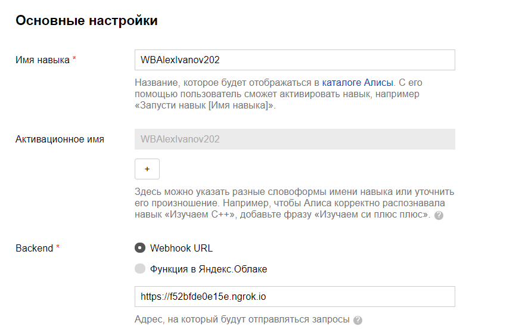
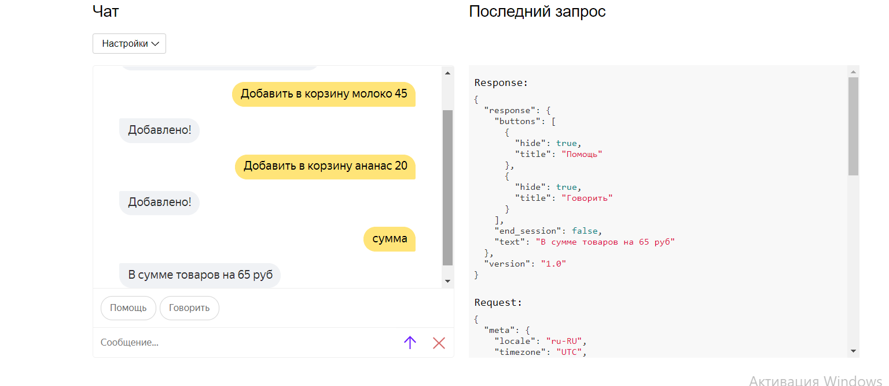
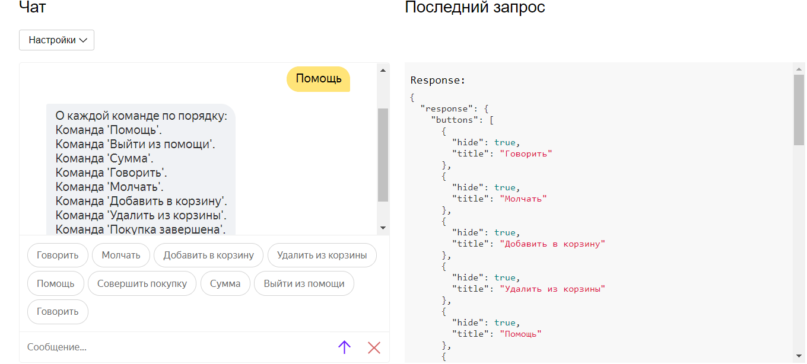
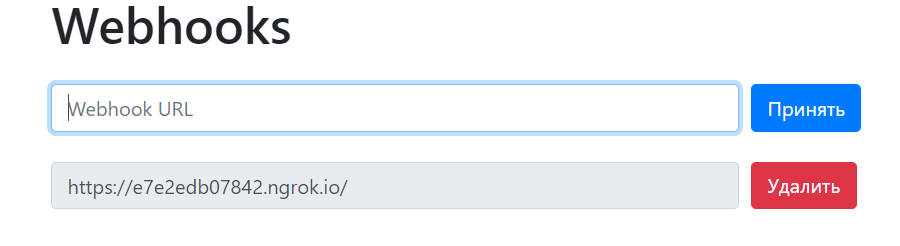

<p align="center">МИНИСТЕРСТВО НАУКИ  И ВЫСШЕГО ОБРАЗОВАНИЯ РОССИЙСКОЙ ФЕДЕРАЦИИ<br>
Федеральное государственное автономное образовательное учреждение высшего образования<br>
"КРЫМСКИЙ ФЕДЕРАЛЬНЫЙ УНИВЕРСИТЕТ им. В. И. ВЕРНАДСКОГО"<br>
ФИЗИКО-ТЕХНИЧЕСКИЙ ИНСТИТУТ<br>
Кафедра компьютерной инженерии и моделирования</p>
<br>
<h3 align="center">Отчёт по лабораторной работе № 2<br> по дисциплине "Программирование"</h3>
<br><br>
<p>студента 1 курса группы ПИ-б-о-202(1)<br>
Иванов Александр Сергеевич<br>
направления подготовки 09.03.04 "Программная инженерия"</p>
<br><br>
<table>
<tr><td>Научный руководитель<br> старший преподаватель кафедры<br> компьютерной инженерии и моделирования</td>
<td>(оценка)</td>
<td>Чабанов В.В.</td>
</tr>
</table>
<br><br>
<p align="center">Симферополь, 2020</p>
<hr>

Цель лабораторной работы:

1. Получить представления о структуре post-запроса;
2. Изучить webhooks как метод взаимодействия web-приложений;

## Постановка задачи

1. Разработать и зарегистрировать навык для Алисы на сервисе Яндекс.Диалоги;

2. В качестве backend-a для навыка реализовать приложение на языке С++ выполняющее следующие функции:

    - Составление продуктовой корзины:
    
        - Добавление продукта в корзину;
        - Удаление продукта из корзины;
        - Очистка корзины;
        - Вывод списка товаров в корзине;
        - Подсчёт стоимости товаров в корзине.

    - Вывод справочной информации по навыку;

    - Регистрацию webhook-ов сторонних сервисов;

    - Отправку данных на сторонние сервисы. 

3. В качестве стороннего сервиса реализовать приложение на языке Python, выполняющее следующие функции:
    - Ожидание данных о покупке;
    - Сохранение поступивших данных в excel-документ.
    
## Выполнение работы

Создаю навык,настраиваю его, присваиваю ему имя : "Поставьте пожалуйста зачёт".

1. Скриншот со страницы настроек навыка:



Рисунок 1. Скриншот настройки навыка.

2. Скриншот работы функционала Корзина.



Рисунок 2. Скриншот корзины.

3. Скриншот работы функционала Помощь:



Рисунок 3. Скриншот помощи.

4. Скриншот страницы управления webhook-ами с добавленным webhook-ом клиентского приложения

Создаю веб-страницу для управления вебхуками. Перед этим создаю конфигурационный файл, откуда будет браться ссылка для вствки в шаблон html кода.
В коде, в функции отправляющей get-запрос я редактирую шаблон html файла и формирую ответ в формате get.
В коде, в функции отправляющей post-запрос я реализую принятие параметра, делаю соответствищие действия с ним в json файле и отправляю ответ в формате post с кодировкой utf-8. 



Рисунок 4. Скриншот страницы с webhook-ами.

Создаю клиентское приложения на языке программирования Python.
Это клиентское приложение создаст файл,а затем в содержимое файла будут записываться данные, которое мы добавляли в корзину в алисе(мы их будем брать от сервера с++).
К сожалению, из-за того, что навык не работает, я не им воспользоваться и данные не будут поступать на клиенсткое приложение. Именно поэтому я условно заполнил эксель файл ,непосредственно приписав к каждой ячейке пример. (однако код на Python написан полностью, и с полным сервером на с++ он бы работал и записывал данные в эксель как нужно).

5. Ссылка на эксель файл:
[excel файл](excel/data.xlsx)

6. Полный код серверного приложения, который я успел написать:
```c++

#include <iostream>
#include <string>
#include <iomanip>
#include <cpp_httplib/httplib.h>
#include <nlohmann/json.h>
using namespace std;
using namespace httplib;
using json = nlohmann::json;


string webhooks_list = "{webhooks_list}";//ищем в html
string Webhook_URL = "{Webhook URL}";//ищем в шаблоне
string shablon = u8R"(
<div class="form-row align-items-center">
    <div class="col">
        <input type="text" value="{Webhook URL}" class="form-control mb-2" disabled>
    </div>
    <div class="col">
        <button type="submit" name="del" value="{Webhook URL}" class="btn btn-danger mb-2">Удалить</button>
    </div>
</div>)";

ofstream file_text("log.txt");//файл лог в папке с cpp

json config_json;//json переменная

json open_file()//проверяет открытие файлов
{
    ifstream cache("config.json");//открываем файл в переменной cache 
    json config_json;
    file_text << u8"Пробуем открыть конфигурационный файл" << endl;//вывод в наш текстовый файл
    if (cache.is_open())//проверяем открылся config.json или нет
    {
        cache >> config_json;//передаем значение в джсон переменную
        file_text << u8"Конфигурационный файл открыт" << endl;//вывод сообщения 
    }
    else//иначе
    {
        file_text << u8"Не удалость открыть конфигурационный файл" << endl;//вывод в текстовый файл
        config_json["webhooks"] = json::array();//создаем пустой массив вебхуков
    
    }

    return config_json;
}

void save_config(json config_json)//обновляем файл
{
    ofstream cache("config.json");//создаем файл

    if (cache.is_open())//если он открылся,то
    {
        cache << config_json.dump(4);//записываем переменную json типа в наш файл
        cache.close();//закрываем его
        file_text << u8"Обновлен конфигурационный файл" << endl;
    }
    else
    {
        file_text << u8"Конфигурационный файл не удалось открыть" << endl;
    }
}

string good_html()//редактируем html код и вывод его
{
    string webhooks_template, AllWebHooks;
    ifstream webhooks_cache("web_html.html");//открываем файл 

    if (webhooks_cache.is_open())//если он открыт
    {
        getline(webhooks_cache, webhooks_template, '\0');//в переменную 2 записываем переменную 1
        webhooks_cache.close();
    }
    else
    {
        return "";
    }

    if (config_json.empty())//если он пустой
    {
        config_json = open_file();//в конфиг джсон записываем вывод функции
    }
    if (config_json["webhooks"].size())//если он не пустой
    {
        for (int i = 0; i < config_json["webhooks"].size(); i++)//редактируем наш код для замены в основном файле html
        {
            string OneWebhook = shablon;
            OneWebhook.replace(OneWebhook.find(Webhook_URL), Webhook_URL.length(), config_json["webhooks"][i]);
            OneWebhook.replace(OneWebhook.find(Webhook_URL), Webhook_URL.length(), config_json["webhooks"][i]);
            AllWebHooks = AllWebHooks + OneWebhook;
        }
        webhooks_template.replace(webhooks_template.find(webhooks_list), webhooks_list.length(), AllWebHooks);
    }
    else//если пустой
    {
        webhooks_template.replace(webhooks_template.find(webhooks_list), webhooks_list.length(), "");//заменяем на пустоту
    }
    return webhooks_template;
}

void del_set_webhooks(const Request& req)//добавляем и удаляем вебхуки
{
    if (config_json.empty())//если он пустой, то обращаемся в функцию и записываем ее вывод в переменную config_json
    {
        config_json = open_file();
    }

    if (req.has_param("del"))//если поступил параметр удалить,то
    {
        string webhook_to_remove = req.get_param_value("del");//название вебхука, который нужно удалить
        for (int i = 0; i < config_json["webhooks"].size(); i++)//ищем файл, который нужно удалить
        {
            
            if (config_json["webhooks"][i] == webhook_to_remove)//если оно нашлось 
            {
                string f = config_json["webhooks"][i];
                config_json["webhooks"].erase(config_json["webhooks"].begin() + i);//удаляем этот вебхук
                file_text << u8"Удалён webhook " << f << endl;//заносим файл
                break;//выход
            }
        }
    }
    else if (req.has_param("set"))//если параметр "добавить"
    {

        if (req.get_param_value("set") == "")//если пользователь добавил пустой вебхук
        {
            file_text << u8"Получен пустой webhook" << endl;
        }
        else//если не пустое имя,то
        {
            file_text << u8"Получен запрос на добавление webhook " << req.get_param_value("set") << endl;
            bool check = false;
            if (config_json["webhooks"].size())//если есть хоть один вебхук 
            {
                for (int i = 0; i < config_json["webhooks"].size(); i++)//проверяем на наличие совпадений
                {
                    if (config_json["webhooks"][i] == req.get_param_value("set"))
                    {
                     
                        check = true;
                        break;
                    }
                }
            }
            if (!check)//если совпадений нет, то мы его добавляем 
            {
                file_text << u8"Добавлен webhook " << req.get_param_value("set") << endl;
                config_json["webhooks"].push_back(req.get_param_value("set"));
            }
        }
    }
    save_config(config_json);//передаем полученное значеное в функцию
    
}

void webhooks_post_resp(const Request& req, Response& res)//отправляем пост запрос
{
    del_set_webhooks(req);
    string output = good_html();
    res.set_content(output, "text/html; charset=UTF-8");
}

void webhooks_page(const Request& req, Response& res)//гет запрос
{
    string output = good_html();
    res.set_content(output, "text/html");
}
json present_session = json::array();

json creating_an_response(const std::string& how_to_write,
	const std::string& how_to_say,
	const json& buttons,
	const json* now_session = nullptr,
	const bool end_session = false)
{
	json ready_answer = {
		{"response", {
			{"buttons", buttons},
			{"end_session", end_session}
		}},
		{"version", "1.0"}
	};
	if (how_to_write != "")
	{
		ready_answer["response"]["text"] = how_to_write;
	}
	if (now_session != nullptr && (*now_session)["voice_mode"] == 1)
	{
		if (how_to_say != "")
		{
			ready_answer["response"]["tts"] = how_to_say;
		}
		ready_answer["response"]["buttons"].push_back({
	{"title", u8"Молчать"},
	{"hide", true}
			});
	}
	else if (now_session != nullptr && (*now_session)["voice_mode"] == 0)
	{
		ready_answer["response"]["buttons"].push_back({
	{"title", u8"Говорить"},
	{"hide", true}
			});
	}
	return ready_answer;
}

void MyAlisa(const Request& req, Response& res)
{

	json req_json = json::parse(req.body);

	std::string user_id = req_json["session"]["application"]["application_id"];
	json response;
	json* session_now = nullptr;

	for (auto& session : present_session)
	{
		if (session["user_id"] == user_id)
		{
			session_now = &session;
			break;
		}
	}

	if (req_json["session"]["new"].get<bool>())
	{
		if (session_now == nullptr)
		{
			json session =
			{
				{"user_id", user_id},
				{"skill_mode", 0},
				{"voice_mode", 0},
				{"cart", json::array()}
			};
			present_session.push_back(session);
			session_now = &present_session[present_session.size() - 1];
		}
		else
		{
			(*session_now)["skill_mode"] = 0;
			(*session_now)["voice_mode"] = 0;
		}

		json response = creating_an_response(
			u8"Привет! Давайте начнем покупки.",
			u8"Прив+ет! Дав+айте начн+ем пок+упки.",
			{
	{
		{"title", u8"Помощь"},
		{"hide", true}
	},
			},
			session_now);

		res.set_content(response.dump(2), "text/json; charset=UTF-8");
		return;
	}

	if (session_now == nullptr)
	{
		json response = creating_an_response(u8"Произошла ошибка", u8"Произошл+а ош+ибка", { {{"title", u8"Помощь"},{"hide", true}}, }, session_now, true);
		res.set_content(response.dump(2), "text/json; charset=UTF-8");
		return;
	}
	std::string received_a_command = req_json["request"]["command"]; //полученная команда
	std::string how_to_write;       //что ответим(письменно)
	std::string how_to_say;         //что ответим(устно)
	if ((*session_now)["skill_mode"] == 1)
	{
		if (received_a_command == u8"помощь")//что выведем, когда получим команду помощь
		{
			how_to_write =
				u8"О каждой команде по порядку:\n"
				u8"Команда 'Помощь'.\n"
				u8"Команда 'Выйти из помощи'.\n"
				u8"Команда 'Сумма'.\n"
				u8"Команда 'Говорить'.\n"
				u8"Команда 'Молчать'.\n"
				u8"Команда 'Добавить в корзину'.\n"
				u8"Команда 'Удалить из корзины'.\n"
				u8"Команда 'Покупка завершена'.\n"
				u8"О чём рассказать подробнее?";
			how_to_say =
				u8"О к+аждой ком+анде по пор+ядку: sil <[600]>\n"
				u8"Ком+анда 'П+омощь' sil <[600]>.\n"
				u8"Ком+анда 'В+ыйти из п+омощи' sil <[600]>.\n"
				u8"Ком+анда 'С+умма' sil <[600]>.\n"
				u8"Ком+анда 'Говор+ить' sil <[600]>.\n"
				u8"Ком+анда 'Молч+ать' sil <[600]>.\n"
				u8"Ком+анда 'Доб+авить в корз+ину' sil <[600]>.\n"
				u8"Ком+анда 'Удал+ить из корз+ины' sil <[600]>. \n"
				u8"Ком+анда 'Пок+упка завершен+а' sil <[600]>. \n"
				u8"О чём рассказ+ать подр+обнее?";
		}
		if (received_a_command == u8"говорить" or received_a_command == u8"1")
		{
			how_to_write = u8"Команда говорить. Данная комманда включает голосовой помощник.\n"
				u8"О чём ещё рассказать?\n";
			how_to_say = u8"Ком+анда говор+ить. Д+анная комм+анда включ+ает голосов+ой пом+ощник.\n"
				u8"О чём ещё рассказ+ать?\n";
		}
		else if (received_a_command == u8"молчать" or received_a_command == u8"2")
		{
			how_to_write = u8"Команда молчать. Данная команда с легкостью отключает голосовой помощник.\n"
				u8"О чём ещё рассказать?\n";
			how_to_say = u8"Ком+анда молч+ать. Д+анная ком+анда с л+егкостью отключ+ает голосов+ой помощник.\n"
				u8"О чём ещё рассказ+ать?\n";
		}
		else if (received_a_command == u8"добавить в корзину" or received_a_command == u8"3")
		{
			how_to_write = u8"Команда добавить в корзину. С помощью этой команды можно добавить товар в корзину.\n"
				u8"О чём ещё рассказать?\n";
			how_to_say = u8"Ком+анда доб+авить в корз+ину sil <[500]>. С п+омощью +этой ком+анды м+ожно доб+авить тов+ар в корз+ину sil <[500]>.\n"
				u8"О чём ещё рассказ+ать?\n";
		}
		else if (received_a_command == u8"удалить из корзины" or received_a_command == u8"4")
		{
			how_to_write = u8"Команда удалить из корзины. С помощью этой команды вы можете удалить товар из корзины.\n"
				u8"О чём ещё рассказать?\n";
			how_to_say = u8"Ком+анда удал+ить из корз+ины sil <[500]>. С п+омощью +этой ком+анды м+ожно удал+ить тов+ар из корз+ины sil <[500]>.\n"
				u8"О чём ещё рассказ+ать?\n";
		}
		else if (received_a_command == u8"помощь" or received_a_command == u8"5")
		{
			how_to_write = u8"Команда помощь. С помощью этой команды можно узнать описание возможностей навыка.\n"
				u8"О чём ещё рассказать?\n";
			how_to_say = u8"Ком+анда п+омощь sil <[500]>. С п+омощью +этой ком+анды м+ожно узн+ать опис+ание возм+ожностей н+авыка sil <[500]>.\n"
				u8"О чём ещё рассказ+ать?\n";
		}
		else if (received_a_command == u8"выйти из помощи")
		{
			how_to_write = u8"Всегда рад помочь!";
			how_to_say = u8"Всегд+а рад пом+очь!";
			(*session_now)["skill_mode"] = 0;
		}
		else if (received_a_command == u8"совершить покупку" or received_a_command == u8"6")
		{
			how_to_write = u8"Команда совершить покупку. С помощью этой команды можно закончить покупку, отправив в эксель файл содержимое корзины и после этого ваша корзина очистится.\n"
				u8"О чём ещё рассказать?\n";
			how_to_say = u8"Ком+анда соверш+ить пок+упку sil <[500]>. С п+омощью +этой ком+анды м+ожно зак+ончить пок+упку, отпр+авив в экс+ель файл содерж+имое корз+ины и п+осле +этого в+аша корз+ина оч+истится sil <[500]>.\n"
				u8"О чём ещё рассказ+ать?\n";
		}
		else if (received_a_command == u8"сумма" or received_a_command == u8"7")
		{
			how_to_write = u8"Команда сумма. С помощью этой команды можно подсчитать сумму стоимости всех товаров, которые находятся в вашей корзине."
				u8"О чём ещё рассказать?\n";
			how_to_say = u8"Ком+анда С+умма sil <[500]>. С п+омощью +этой ком+анды м+ожно подсчит+ать с+умму ст+оимости всех тов+аров, кот+орые нах+одятся в в+ашей корз+ине sil <[500]>."
				u8"О чём ещё рассказ+ать?\n";
		}
		else
		{
			how_to_write = u8"Вы ввели неверную команду.";
			how_to_say = u8"Вы ввел+и нев+ерную ком+анду.";
		}
		json response;
		if ((*session_now)["skill_mode"] == 1)
		{
			response = creating_an_response(how_to_write, how_to_say, {
	{
		{"title", u8"Говорить"},
		{"hide", true}
	},
	{
		{"title", u8"Молчать"},
		{"hide", true}
	},
	{
		{"title", u8"Добавить в корзину"},
		{"hide", true}
	},
	{
		{"title", u8"Удалить из корзины"},
		{"hide", true}
	},
	{
		{"title", u8"Помощь"},
		{"hide", true}
	},
	{
		{"title", u8"Совершить покупку"},
		{"hide", true}
	},
	{
		{"title", u8"Сумма"},
		{"hide", true}
	},
	{
		{"title", u8"Выйти из помощи"},
		{"hide", true}
	},

				}, session_now);
		}
		else
		{
			response = creating_an_response(how_to_write, how_to_say, {
	{
		{"title", u8"Помощь"},
		{"hide", true}
	},
				}, session_now);
		}
		res.set_content(response.dump(2), "text/json; charset=UTF-8");
	}

	else {
		if (received_a_command == u8"молчать")
		{
			std::string how_to_write = u8"Как прикажите :(";
			std::string how_to_say;
			(*session_now)["voice_mode"] = 0;
			json response = creating_an_response(
				how_to_write,
				how_to_say,
				{
	{
		{"title", u8"Помощь"},
		{"hide", true}
	},
				},
				session_now);
			res.set_content(response.dump(2), "text/json; charset=UTF-8");
		}
		else if (received_a_command == u8"говорить")
		{
			std::string how_to_write = u8"Хорошо.";
			std::string how_to_say = u8"Хорош+о.";
			(*session_now)["voice_mode"] = 1;
			json response = creating_an_response(how_to_write, how_to_say, { {{"title", u8"Помощь"},{"hide", true}}, }, session_now);
			res.set_content(response.dump(2), "text/json; charset=UTF-8");
		}
		else if (received_a_command == u8"помощь")
		{
			how_to_write =
				u8"О каждой команде по порядку:\n"
				u8"Команда 'Помощь'.\n"
				u8"Команда 'Выйти из помощи'.\n"
				u8"Команда 'Сумма'.\n"
				u8"Команда 'Говорить'.\n"
				u8"Команда 'Молчать'.\n"
				u8"Команда 'Добавить в корзину'.\n"
				u8"Команда 'Удалить из корзины'.\n"
				u8"Команда 'Покупка завершена'.\n"
				u8"О чём рассказать подробнее?";
			how_to_say =
				u8"О к+аждой ком+анде по пор+ядку: sil <[600]>\n"
				u8"Ком+анда 'П+омощь' sil <[600]>.\n"
				u8"Ком+анда 'В+ыйти из п+омощи' sil <[600]>.\n"
				u8"Ком+анда 'С+умма' sil <[600]>.\n"
				u8"Ком+анда 'Говор+ить' sil <[600]>.\n"
				u8"Ком+анда 'Молч+ать' sil <[600]>.\n"
				u8"Ком+анда 'Доб+авить в корз+ину' sil <[600]>.\n"
				u8"Ком+анда 'Удал+ить из корз+ины' sil <[600]>.\n"
				u8"Ком+анда 'Пок+упка завершен+а' sil <[600]>.\n"
				u8"О чём рассказ+ать подр+обнее?";
			json response = creating_an_response(
				how_to_write,
				how_to_say,
				{
	{
		{"title", u8"Говорить"},
		{"hide", true}
	},
	{
		{"title", u8"Молчать"},
		{"hide", true}
	},
	{
		{"title", u8"Добавить в корзину"},
		{"hide", true}
	},
	{
		{"title", u8"Удалить из корзины"},
		{"hide", true}
	},
	{
		{"title", u8"Помощь"},
		{"hide", true}
	},
	{
		{"title", u8"Совершить покупку"},
		{"hide", true}
	},
	{
		{"title", u8"Сумма"},
		{"hide", true}
	},
	{
		{"title", u8"Выйти из помощи"},
		{"hide", true}
	},

				},
				session_now);
			(*session_now)["skill_mode"] = 1;
			res.set_content(response.dump(2), "text/json; charset=UTF-8");
		}
		else if (received_a_command == u8"очистить корзину")
		{
			std::string how_to_write = u8"Корзина очищена.";
			std::string how_to_say = u8"Кориз+ина оч+ищена.";
			json response = creating_an_response(
				how_to_write,
				how_to_say,
				{
	{
		{"title", u8"Помощь"},
		{"hide", true}
	},
				},
				session_now);
			(*session_now).erase("cart");
			(*session_now)["cart"] = json::array();
			res.set_content(response.dump(2), "text/json; charset=UTF-8");
		}
		else if (received_a_command == u8"что в корзине")
		{

			std::string how_to_write;
			std::string how_to_say;

			if ((*session_now)["cart"].empty())
			{
				how_to_write = u8"Вы ничего не добавили в корзину";
				how_to_say = u8"Вы ничег+о не доб+авили в корзину.";
			}
			else
			{
				how_to_write = u8"В корзине следующие товары: ";
				for (auto& sells : (*session_now)["cart"])
				{
					int price = sells["price"].get<int>();

					how_to_write += "\n" + sells["item"].get<std::string>() + std::to_string(price);
					how_to_write += u8" рублей, ";

				}
				how_to_write.pop_back();
				how_to_say = how_to_write;
			}

			json response = creating_an_response(
				how_to_write,
				how_to_say,
				{
	{
		{"title", u8"Помощь"},
		{"hide", true}
	},
				},
				session_now);
			res.set_content(response.dump(2), "text/json; charset=UTF-8");
		}
		else if (received_a_command == u8"покупка завершена")
		{
			std::string how_to_write = u8"Ждем вас в гости!";
			std::string how_to_say = u8"Ждем вас в г+ости!";

			json output =
			{
				{"user_id", user_id},
				{"cart", (*session_now)["cart"]}
			};

			json config = config_json;


			(*session_now).erase("cart");
			(*session_now)["cart"] = json::array();

			json response = creating_an_response(
				how_to_write,
				how_to_say,
				{
	{
		{"title", u8"Помощь"},
		{"hide", true}
	},
				},
				session_now,
				true);
			res.set_content(response.dump(2), "text/json; charset=UTF-8");
		}
		else if (received_a_command == u8"сумма")
		{
			std::string how_to_write = "";
			std::string how_to_say = "";

			size_t size = req_json["request"]["nlu"]["tokens"].size();
			int all_money = 0;
			for (auto& money : (*session_now)["cart"])
			{
				all_money += money["price"].get<int>();
			}
			how_to_write = u8"В сумме товаров на " + std::to_string(all_money) + u8" руб";
			how_to_say = u8"В сумме товаров на " + std::to_string(all_money) + u8" руб";

			json response = creating_an_response(
				how_to_write,
				how_to_say,
				{
	{
		{"title", u8"Помощь"},
		{"hide", true}
	},
				},
				session_now);
			res.set_content(response.dump(2), "text/json; charset=UTF-8");
		}
		else if (received_a_command.find(u8"добавить в корзину") == 0 || received_a_command.find("добавь в корзину") == 0)
		{
			std::string how_to_write = u8"Добавлено!";
			std::string how_to_say = u8"Доб+авлено!";
			std::string item;
			int	price = 0;
			int	index = 0;
			bool index_set = false;

			for (auto object : req_json["request"]["nlu"]["entities"])
			{
				if (object["type"].get<std::string>() == "YANDEX.NUMBER")
				{
					index = object["tokens"]["start"];
					int value = object["value"];
					if (value <= 0)
					{
						how_to_write = u8"Неправильно введена цена товара.";
						how_to_say = u8"Неправильно введена цена товара.";
					}
					else
					{
						price = value;
					}
					index_set = true;
					break;
				}
			}
			if (!index_set)
			{
				how_to_write = u8"Не указана цена товара.";
				how_to_say = u8"Не указана цена товара.";
			}
			else if (index == 3)
			{
				how_to_write = u8"Не указано название товара.";
				how_to_say = u8"Не указано название товара.";
			}
			else
			{
				for (int i = 3; i < index; ++i)
				{
					item += req_json["request"]["nlu"]["tokens"][i].get<std::string>();
					item += " ";
				}
				item.pop_back();
				json item = {
					{"item",  item},
					{"price", price}
				};
				(*session_now)["cart"].push_back(item);
			}

			json response = creating_an_response(
				how_to_write,
				how_to_say,
				{
	{
		{"title", u8"Помощь"},
		{"hide", true}
	},
				},
				session_now);

			res.set_content(response.dump(2), "text/json; charset=UTF-8");
		}
		else if (received_a_command.find(u8"удалить из корзины") == 0 || received_a_command.find(u8"удали из корзины") == 0 || received_a_command.find(u8"убрать из корзины") == 0 || received_a_command.find(u8"убери из корзины") == 0)
		{

			std::string how_to_write;
			std::string how_to_say;
			std::string item = "";

			for (int i = 3; i < req_json["request"]["nlu"]["tokens"].size(); ++i)
			{
				item += req_json["request"]["nlu"]["tokens"][i].get<std::string>();
				item += " ";
			}
			bool found_item = false;
			int	index = 0;

			if (item == "")
			{
				how_to_write = u8"Не написали,что нужно убрать";
				how_to_say = u8"Не напис+али,что н+ужно убр+ать";
			}
			else
			{
				item.pop_back();
				for (auto& cart_item : (*session_now)["cart"])
				{
					if (cart_item["item"].get<std::string>() == item)
					{
						found_item = true;
						break;
					}
					++index;
				}
				if (!found_item)
				{
					how_to_write = u8"Этого товара нет в вашей корзине";
					how_to_say = u8"Этого товара нет в вашей корзине";
				}
				else
				{
					how_to_write = u8"Удалено.";
					how_to_say = u8"Удален+о.";
					(*session_now)["cart"].erase((*session_now)["cart"].begin() + index);
				}
			}
			json response = creating_an_response(
				how_to_write,
				how_to_say,
				{
	{
		{"title", u8"Помощь"},
		{"hide", true}
	},
				},
				session_now);
			res.set_content(response.dump(2), "text/json; charset=UTF-8");
		}
		else
		{
			std::string how_to_write = u8"Я не знаю такую команду.";
			std::string how_to_say = u8"Я не зн+аю так+ую ком+анду.";

			json response = creating_an_response(
				how_to_write,
				how_to_say,
				{
	{
		{"title", u8"Помощь"},
		{"hide", true}
	},
				},
				session_now);

			res.set_content(response.dump(2), "text/json; charset=UTF-8");
		}
	}
}
int main()
{
    Server WH;

    WH.Post("/webhooks", webhooks_post_resp);//вызываем пост 
    WH.Get("/webhooks", webhooks_page);//вызываем гет
	WH.Post("/", MyAlisa);
    cout << "Server started..." << endl;
    file_text << u8"Сервер запущен без ошибок" << endl;
    WH.listen("localhost", 1234);
}

```

7. Полный исходный код клиентского приложения:

```Python

from flask import Flask, request, jsonify
from datetime import datetime
import openpyxl

Buffer = []


def GetEmptyCell(sheet):
    i = 2
    while sheet[i][0].value != None:
        i += 1
    return i


def ListGenerate(sheet):
    num = GetEmptyCell(sheet)
    for i in range(len(Buffer)):
        for j in range(len(Buffer[i]['check'])):
            sheet[num][0].value = num - 1
            sheet[num][1].value = Buffer[i]['user_id']
            sheet[num][2].value = Buffer[i]['datetime']
            sheet[num][3].value = Buffer[i]['check'][j]['item']
            sheet[num][4].value = Buffer[i]['check'][j]['price']
            num += 1
    del num, i, j
    return sheet


def BufferToExcel():
    global Buffer
    try:
        book = openpyxl.open(r'C:\Users\Inquisitor\source\repos\Programming\Lab\02\excel\data.xlsx', read_only=False)
    except:
        book = openpyxl.Workbook()
    sheet = book.active
    if sheet['A1'].value == None:
        sheet['A1'] = 'N'
        sheet['B1'] = 'User ID'
        sheet['C1'] = 'Datetime'
        sheet['D1'] = 'Item'
        sheet['E1'] = 'Prise'
    sheet = ListGenerate(sheet)
    book.save(r'C:\Users\Inquisitor\source\repos\Programming\Lab\02\excel\data.xlsx')
    book.close()


def BufferGenerate(data):
    global Buffer
    data['datetime'] = datetime.now().strftime("%d.%m.%Y %H:%M:%S")
    Buffer.append(data)
    if len(Buffer) >= 1000:
        BufferToExcel()
        Buffer = []


app = Flask(__name__)


@app.route('/', methods=['POST', 'GET'])
def index():
    if request.method == 'POST':
        data = request.json
        BufferGenerate(data)
        return 'OK'

    elif request.method == 'GET':
        return 'Это GET запрос'


if __name__ == "__main__":
    app.run()

```

## Вывод

В ходе лабораторной работы я научился:

- Работать с excel файлами, Flask, datetime на языке программирования python.
- Работать с post запросами на языке программирования c++.
- Создавать навыки Алисы.

