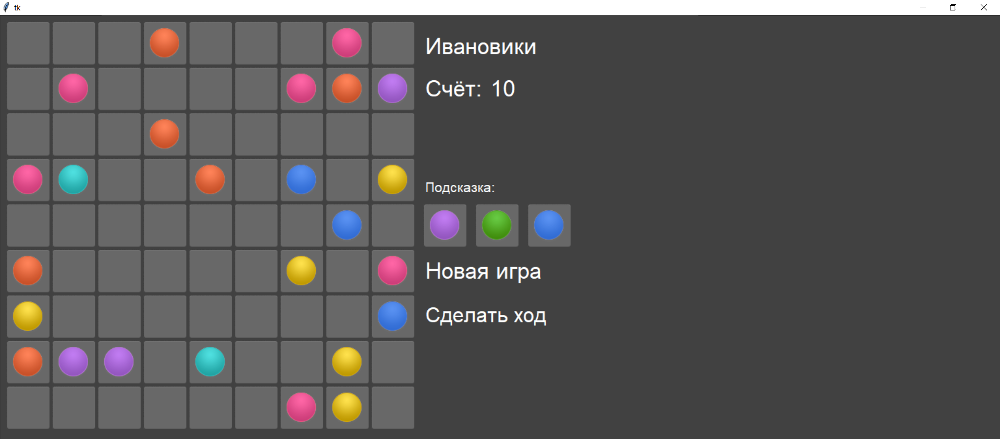

МИНИСТЕРСТВО НАУКИ  И ВЫСШЕГО ОБРАЗОВАНИЯ РОССИЙСКОЙ ФЕДЕРАЦИИ 
Федеральное государственное автономное образовательное учреждение высшего образования 
"КРЫМСКИЙ ФЕДЕРАЛЬНЫЙ УНИВЕРСИТЕТ им. В. И. ВЕРНАДСКОГО" 
ФИЗИКО-ТЕХНИЧЕСКИЙ ИНСТИТУТ 
Кафедра компьютерной инженерии и моделирования

 
<h3 align="center">Отчёт по лабораторной работе № 3  по дисциплине "Программирование"</h3>

  

студента 1 курса группы ПИ-б-о-201(2) 
Иванова Александра Сергеевича 
направления подготовки 09.03.04 "Программная инженерия"

  
<table>
<tr><td>Научный руководитель  старший преподаватель кафедры  компьютерной инженерии и моделирования</td>
<td>(оценка)</td>
<td>Чабанов В.В.</td>
</tr>
</table>
  

Симферополь, 2020

## Постановка задачи

1. Используя стандартный модуль для разработки программ с графическим интерфейсом Tkinter реализуйте игру Lines на языке Python.

2. В качестве образца графического интерфейса используйте [данную игру](http://game-shariki.ru/linii-2).

Подробности указаны далее.

## Цель работы

- Закрепить навыки разработки программ с простым графическим интерфейсом пользователя на языке Python при помощи библиотеки Tkinter;
- Получить представление о разработке простых игровых приложений.

## Выполнение работы

#### Подготовка к созданию программы

1. Подробно изучаем модуль tkinter, для его дальнейшего использования.

2. Анализируем предложенный нам дизайн игры.

#### Создание игры

Создаём приложение, сходное с образцом по графическому интерфейсу и выполняющее те же функции, с одной поправкой: удаление шариков и начисление очков выполняется только в том случает, если ряд составляет **ровно** пять шариков, а не при любом их количестве из расчёта 2 балла за шарик, как в оригинале.

Приложение выполняем согласно [методичке](https://vladimirchabanov.github.io/lab3.html)

*Рисунок 1. Интерфейс игры*

[Ссылка на исходный код приложения](./zxc.py/main.py)

## Вывод

- Был изучен модуль tkinter на начальном уровне

- Приложение не было до конца доработано, однако оно обязательно будет закончено в ближайший месяц!