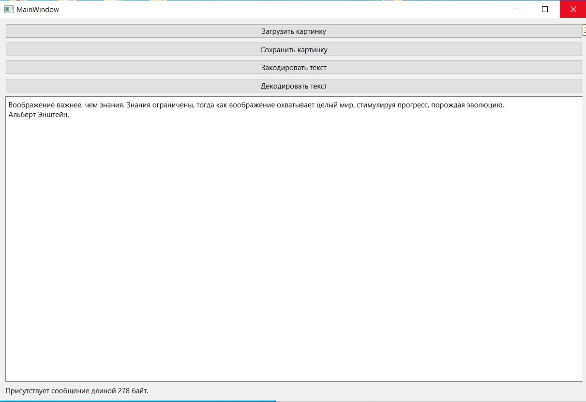
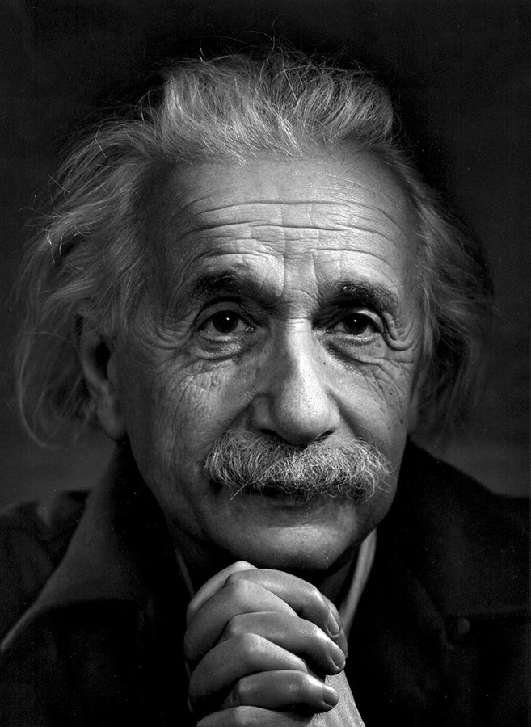

МИНИСТЕРСТВО НАУКИ  И ВЫСШЕГО ОБРАЗОВАНИЯ РОССИЙСКОЙ ФЕДЕРАЦИИ 
Федеральное государственное автономное образовательное учреждение высшего образования 
"КРЫМСКИЙ ФЕДЕРАЛЬНЫЙ УНИВЕРСИТЕТ им. В. И. ВЕРНАДСКОГО" 
ФИЗИКО-ТЕХНИЧЕСКИЙ ИНСТИТУТ 
Кафедра компьютерной инженерии и моделирования

 
<h3 align="center">Отчёт по лабораторной работе № 5  по дисциплине "Программирование"</h3>

  

студента 1 курса группы ПИ-б-о-202(1) 
Иванова Александра Сергеевича 
направления подготовки 09.03.04 "Программная инженерия"

  
<table>
<tr><td>Научный руководитель  старший преподаватель кафедры  компьютерной инженерии и моделирования</td>
<td>(оценка)</td>
<td>Чабанов В.В.</td>
</tr>
</table>
  

Симферополь, 2020

## Постановка задачи

Создать десктоп приложение с GUI позволяющее сохранять текстовую информацию в изображение формата png без видимого изменения исходного изображения. Приложение должно позволять сохранять текст в картинку и извлекать текст из картинки.

## Цель работы

- Изучить базовые встроенные элементы фреймворка Qt предназначенные для создания приложений с графическим интерфейсом пользователя (GUI)

- Изучить сигнально-слотовую систему, как один из способов организации взаимодействия компонентов GUI

- Получить практический навык работы с побитовыми операторами

## Выполнение работы

Я разработал графический интерфейс приложения для работы с кодировкой и декодировкой, используя дизайнер графического интерфейса Qt Designer. Далее мною было разработано приложение на языке C++: я обеспечил связь между кнопками графического интерфейса и функциями моего приложения после того, как подключил файл гр. интерфейса к проекту. После написания основного кода на C++, я написал аналогичный на языке Python.Затем я декодировал изображение, которое нам было предложено.

 
<em>Рисунок 1. Интерфейс приложения</em>

### Как его зовут и что он обещал?

Его зовут **Rick Astley**. Он обещал показать **трейлер GTA VI**.

 
<em>Рисунок 2. Albert Einstein</em>

### Каталоги

[[C++]](./C++)

[Рисунок с зашифрованным текстом](./images/Einstein.png)

[[Python]](./Python)

## Вывод

- Я изучил базовые встроенные элементы фреймворка Qt предназначенные для создания приложений с GUI

- Я изучил сигнально-слотовую систему, как один из способов организации взаимодействия компонентов GUI

- Я получил практический навык работы с побитовыми операторами